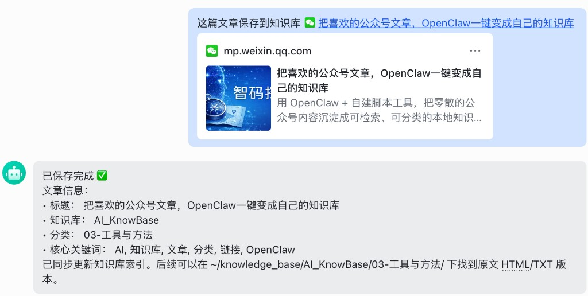

# wechat-to-kb

> 把微信公众号、网页、视频、小红书、RSS 统一沉淀为本地知识库，随时供 AI 检索与问答。

---

## 为什么做这个

微信公众号文章读完就忘，收藏了也找不到。  
B 站视频、小红书笔记、RSS 订阅……碎片信息越积越多，却无法被 AI 统一检索。

**wechat-to-kb** 的目标：让你读过的每一篇内容都变成可搜索、可问答的本地知识。

---

## 包含七个模块

| 模块 | 功能 |
|---|---|
| `run.sh` | 顶层统一入口，聊天工具只接这一条，内部自动分流到公众号 / 视频 / 网页 |
| `wechat_collector` | 公众号文章采集，管理微信登录态，保留评论 PoC 能力 |
| `web_collector` | 普通网页采集，自动路由到对应知识库 |
| `common` | 全仓库共享的知识库配置、路由、落盘、索引与文本处理层 |
| `video_collector` | 视频转文本，支持 B 站、YouTube、小红书视频号等（yt-dlp + 字幕提取） |
| `xhs_collector` | 小红书收藏夹批量入库 |
| `rss_daily` | RSS 订阅聚合，微信公众号文章自动归档 |

所有内容统一存储为**本地文本文件**，按知识库分类管理，可直接接入任何支持本地文件的 AI 工具（OpenClaw、Cursor、Obsidian、RAG 等）。

---

## 使用方式

### 方式一：在 AI 助手对话里直接说（推荐）

不用开终端。在任何接入了仓库根 `run.sh` 的 AI 助手里，直接说一句话就能保存：

**OpenClaw / Cursor 对话框：**
```
帮我把这篇文章保存到知识库 https://mp.weixin.qq.com/s/xxxxxx
```

**飞书机器人：**  
把公众号文章链接分享给 AI Bot，说"保存到知识库"，Bot 自动执行并回复保存结果：



AI 助手会自动判断文章分类、选择对应知识库，并返回保存结果（标题、分类、核心关键词）。

**原理**：AI 助手通过 exec 工具直接调用 `run.sh`，无需终端介入。无 TTY 环境下（AI 后台执行）自动选得分最高的知识库，无需人工确认。

#### 配置 AI 助手

在你的 AI 助手的工具描述文件（如 OpenClaw 的 `TOOLS.md`、Cursor 的 `AGENTS.md`）中加入以下条目：

```markdown
**wechat-to-kb（统一链接入库）**
- 用户说「保存到知识库 <URL>」时，直接 exec 执行：
  `/bin/bash ~/path/to/wechat-to-kb/run.sh "<URL>"`
- 脚本会自动分流：公众号 -> `wechat_collector`；视频站 -> `video_collector`；其余网页 -> `web_collector`
- 指定知识库：加 `--kb ai` / `engineering` / `management` / `pm`
- 批量保存：`run.sh -f urls.txt`
- 无 TTY 下自动非交互，无需加 `-n`
- 若面向 OpenClaw，建议将脚本 stdout 原样返回给用户，不要改写
```

将 `~/path/to/wechat-to-kb` 替换为你的实际安装路径。

当前推荐布局：

- 真实仓库：`~/DevProjects/wechat-to-kb`
- OpenClaw 入口：`~/.openclaw/wechat-to-kb`（软链接到真实仓库）

---

### 方式二：终端命令行

```bash
cd ~/.openclaw/wechat-to-kb
./run.sh "https://mp.weixin.qq.com/s/xxxxxx"
./run.sh "https://example.com/article"
./run.sh "https://www.bilibili.com/video/BVxxxxx"
```

---

## 接入 OpenClaw

如果你使用 [OpenClaw](https://openclaw.ai)，按以下步骤配置后，可以直接在对话框说"帮我保存这个链接"，无需打开终端。

### 1. clone 到项目目录，并保留 OpenClaw 入口

```bash
git clone https://github.com/careycao/wechat-to-kb.git ~/DevProjects/wechat-to-kb
ln -s ~/DevProjects/wechat-to-kb ~/.openclaw/wechat-to-kb
```

### 2. 配置知识库

```bash
cp ~/.openclaw/wechat-to-kb/common/kb_config.example.py \
   ~/.openclaw/wechat-to-kb/common/kb_config.local.py
# 编辑 kb_config.local.py，修改知识库名称、分类和关键词
```

### 3. 初始化环境 + 微信登录

```bash
cd ~/.openclaw/wechat-to-kb
./run.sh "https://mp.weixin.qq.com/s/任意一篇公众号文章"
# 首次运行会自动创建 .venv 并安装依赖，同时弹出浏览器扫码登录微信
# 登录态自动保存，之后无需重复登录
```

### 4. 在 TOOLS.md 里注册工具

打开 `~/.openclaw/workspace/TOOLS.md`，加入以下内容：

```markdown
**wechat-to-kb（统一链接入库）**
- 用户说「保存到知识库 <URL>」时，直接 exec 同步执行：
  `/bin/bash ~/.openclaw/wechat-to-kb/run.sh "<URL>"`
- 自动分流：公众号 -> `wechat_collector`；视频站 -> `video_collector`；其余网页 -> `web_collector`
- 指定知识库：加 `--kb ai` / `engineering` / `management` / `pm`
- 批量保存：`run.sh -f urls.txt`
- 无 TTY 下自动非交互，无需加 `-n`
- 执行完成后将脚本 stdout 原样输出给用户，不要改写
```

### 5. 重启 OpenClaw

重启后在对话框直接说：

```
帮我把这篇文章保存到知识库 https://mp.weixin.qq.com/s/xxxxxx
```

如果你刚更新过 OpenClaw 的工具配置，建议直接开一个新会话再试，避免旧会话继续沿用缓存指令。

---

## 快速开始

### 1. 配置仓库

```bash
git clone git@github.com:careycao/wechat-to-kb.git
cd wechat-to-kb
cp common/kb_config.example.py common/kb_config.local.py
# 编辑 kb_config.local.py，设置你的知识库根目录
```

### 2. 保存第一篇公众号文章

```bash
cd ~/.openclaw/wechat-to-kb
./run.sh "https://mp.weixin.qq.com/s/xxxxxx"
```

首次运行会自动创建 `.venv`、安装依赖，并尽量复用本机已安装的 Chrome / Chromium；公众号文章首次使用会打开浏览器，扫码登录微信即可，登录态自动保存。

---

## 各模块使用

### 顶层统一入口（推荐给聊天工具 / 飞书 / OpenClaw）

```bash
cd ~/.openclaw/wechat-to-kb

# 公众号文章
./run.sh "https://mp.weixin.qq.com/s/xxxxx"

# 普通网页
./run.sh "https://example.com/article"

# 视频链接
./run.sh "https://www.bilibili.com/video/BVxxxxx"

# 批量
./run.sh -f urls.txt

# 仅对公众号尝试抓评论
./run.sh --comments "https://mp.weixin.qq.com/s/xxxxx"
```

说明：
- 顶层入口会自动分流到 `wechat_collector` / `video_collector` / `web_collector`
- 这是最适合给聊天工具配置的入口，后续内部结构继续调整也不影响外部调用

### wechat_collector（公众号）

```bash
cd wechat_collector

# 保存单篇文章
./run.sh "https://mp.weixin.qq.com/s/xxxxx"

# 额外尝试抓取公众号评论（PoC）
./run.sh --comments "https://mp.weixin.qq.com/s/xxxxx"

# 指定知识库
./run.sh --kb ai "https://..."

# 批量导入（urls.txt 每行一个链接）
./run.sh -f urls.txt

# 重建索引
./run.sh --reindex
```

详细说明见 [wechat_collector/USAGE.md](wechat_collector/USAGE.md)。

说明：
- `--comments` 仅对公众号文章生效，依赖已保存的微信登录态。
- 评论会附加到正文末尾一起写入知识库，便于后续统一检索。
- 当前为 PoC 模式，评论抓取失败不会影响正文保存。

### web_collector（普通网页）

```bash
cd web_collector
./run.sh "https://example.com/article"
./run.sh --kb engineering "https://example.com/article"
./run.sh -f urls.txt
./run.sh --reindex
```

详细说明见 [web_collector/USAGE.md](web_collector/USAGE.md)。

### video_collector（视频转文本）

```bash
cd video_collector

# 首次使用：登录 B 站获取 cookies
./run.sh --login

# 保存视频（提取字幕/简介）
./run.sh "https://www.bilibili.com/video/BVxxxxx"
./run.sh "https://www.youtube.com/watch?v=xxxxx"
```

详细说明见 [video_collector/README.md](video_collector/README.md)。

### xhs_collector（小红书收藏）

```bash
cd xhs_collector
./run.sh
```

### rss_daily（RSS 订阅日报）

```bash
cp rss_daily/rss_config.example.yaml rss_daily/config.yaml
# 编辑 config.yaml，填入你的 RSS 订阅源
cd rss_daily && ./run.sh
```

---

## 存储结构

所有内容按知识库 + 分类目录存储，每篇文章保留 `.md`（Markdown，供 AI 检索和 Obsidian 查看）和 `.html`（原始存档）两个文件，根目录自动生成 `README.md` 索引：

```
~/knowledge_base/
├── AI_KnowBase/
│   ├── README.md               ← 自动生成的文章索引（标题、摘要、关键词）
│   ├── 01-战略与框架/
│   │   ├── 文章标题.md
│   │   └── 文章标题.html
│   ├── 05-AI Coding/
│   │   ├── 另一篇文章.md
│   │   └── 另一篇文章.html
│   └── 06-未分类/
├── Engineering_KnowBase/
├── Management_KnowBase/
└── PM_KnowBase/
```

分类和知识库名称完全可自定义，见 `common/kb_config.example.py`。

---

## 环境要求

- Python 3.10+
- Playwright（用于微信公众号登录态保持）
- yt-dlp（视频字幕提取，video_collector 使用）

---

## License

MIT
